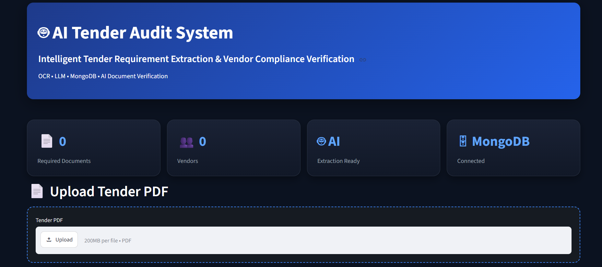
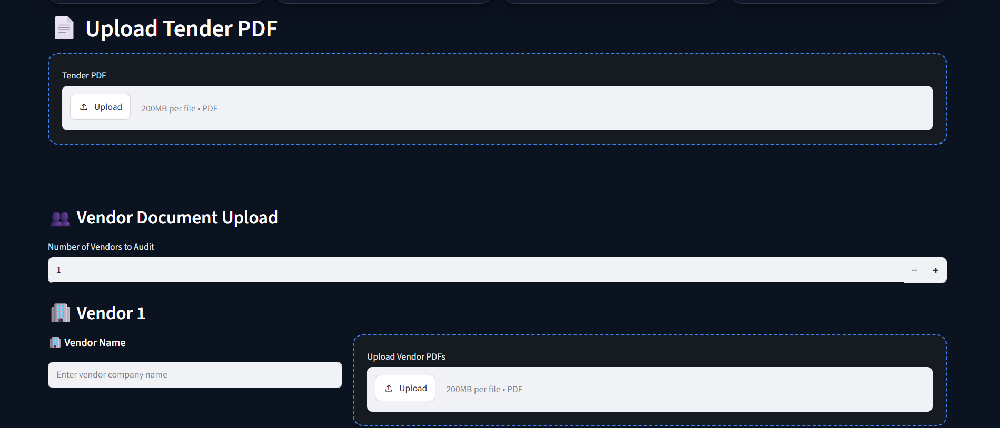
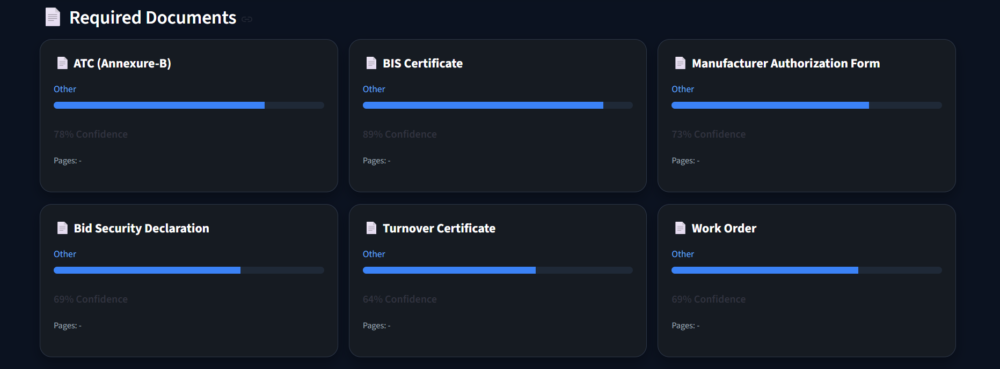
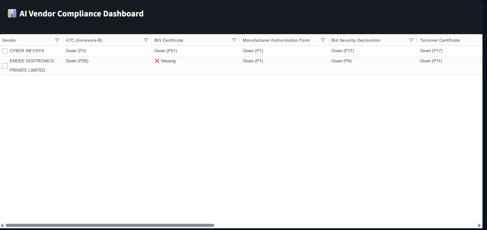
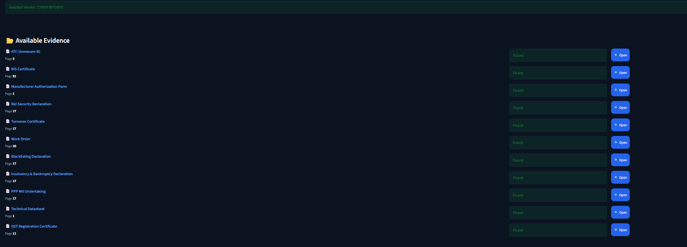
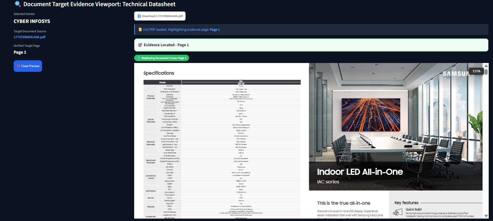

# 🤖 AI-Powered Tender Compliance Verification System

> **Transform multi-hundred-page tender documents and scanned vendor certificates into a confidence-scored compliance matrix using OCR, deterministic rule matching, and LLM verification.**


This project demonstrates how production AI systems can automate document-intensive compliance workflows while remaining transparent about uncertainty.

Instead of forcing every decision into a binary result, the system classifies each requirement as:

- ✅ Satisfied
- ❌ Missing
- ⚠️ Requires Manual Review

**Engineering Principle**

> Production AI systems should know when they are uncertain instead of pretending to be correct.

---


---
# 🎥 Demo

🎬 **Watch the Full Demo**

➡️ **[AI Tender Compliance Verification Demo](AI_Tender_Audit_Demo.mp4)**
---
# ⭐ Project Highlights

- ✅ Processes multi-hundred-page tender documents
- ✅ OCR support for scanned PDFs
- ✅ Local LLM verification using Ollama
- ✅ Confidence-scored compliance decisions
- ✅ Human-in-the-loop review workflow
- ✅ Interactive compliance dashboard with page-level evidence
---
# 📌 Problem

Manual tender verification requires engineers to read hundreds of pages of tender documents and compare them against numerous vendor certificates.

This process is repetitive, time-consuming, and prone to human error.

The goal of this project is to automate requirement extraction and compliance verification while keeping humans involved whenever the available evidence is uncertain.
---
# 💡 Solution

The system automatically

- Extracts tender requirements
- Reads vendor PDFs
- Uses OCR
- Performs deterministic matching
- Uses LLM verification
- Produces a compliance matrix
- Routes uncertain cases to manual review
---
# 🧠 Engineering Decision

Most AI systems always return a binary answer.

This project intentionally avoids that.

Instead, it combines

- OCR confidence
- Regex validation
- Alias matching
- Deterministic verification
- LLM verification

If evidence is incomplete or conflicting, the system returns

⚠️ Requires Manual Review

instead of making an unreliable automated decision.


---

🏗 System Architecture
```text

                Tender PDF
                    │
                    ▼
      Requirement Extraction Engine
                    │
                    ▼
          Required Documents List
                    │
                    ▼
          Vendor PDF Processing
                    │
                    ▼
          OCR (Tesseract/PaddleOCR)
                    │
                    ▼
       Deterministic Rule Matching
                    │
                    ▼
          LLM Verification (Ollama)
                    │
                    ▼
          Confidence Scoring Engine
                    │
                    ▼
        Compliance Matrix Dashboard
```
---
# ⚙ Core Capabilities

## 📄 Tender Processing

- Extract mandatory tender requirements automatically
- Identify required vendor compliance documents
- Normalize document aliases and multi-word synonyms

## 📑 Vendor Verification

- OCR engine for scanned, low-quality, or multi-page PDFs
- Precise evidence extraction with page-level mapping
- Cross-document validation

## 🤖 AI Verification

- Deterministic rule matching for high precision
- Local LLM (Ollama/Gemma) verification
- Dynamic confidence scoring
- Human-in-the-loop workflow routing

## 📊 Dashboard & UX

- Dynamic compliance matrix
- PDF evidence viewer
- Interactive technical datasheet extraction
---
# ⚡Quick Start
```bash
git clone https://github.com/mantukushali-cmyk/AI-Tender-Audit-System.git
cd AI-Tender-Audit-System
pip install -r requirements.txt
streamlit run app.py
```
# 🚀 Detailed Installation

## Clone the repository

```bash
git clone https://github.com/mantukushali-cmyk/AI-Tender-Audit-System.git
cd AI-Tender-Audit-System
```

## Create a virtual environment

```bash
python -m venv venv
```

## Activate the environment

### Windows

```bash
venv\Scripts\activate
```

### macOS/Linux

```bash
source venv/bin/activate
```

## Install dependencies

```bash
pip install -r requirements.txt
```

## Run the application

```bash
streamlit run app.py
```

Open your browser at:

```text
http://localhost:8501
```
---
# 🛠 Tech Stack

| Category | Technologies |
|----------|--------------|
| Backend | Python, Streamlit |
| AI & OCR | Ollama (Gemma), Tesseract OCR, PaddleOCR |
| Data Processing | Pandas, PyMuPDF (fitz), Regex |
| Database | MongoDB |
| UI | AgGrid |
---

# 📊 System Workflow
```text
Tender PDF
           │
           ▼
 Requirement Extraction
           │
           ▼
    Vendor Documents
           │
           ▼
          OCR
           │
           ▼
      Rule Matching
           │
           ▼
    LLM Verification
           │
           ▼
   Confidence Scoring
           │
           ▼
   Compliance Matrix

```
---
# 📊 Sample Compliance Matrix

| Requirement       | Status                     | Evidence        |
|-------------------|----------------------------|-----------------|
| PAN Card          | ✅ Satisfied               | Page 14         |
| GST Certificate   | ✅ Satisfied              | Page 22          |
| OEM Authorization | ❌ Missing                | Not Found        |
| Warranty Letter   | ⚠️ Requires Manual Review | Confidence: 61%  |
---
# 📁 Project Structure
```text
AI-Tender-Audit-System/
│
├── app.py
├── database/
├── modules/
│   ├── tender_extractor.py
│   ├── vendor_processor.py
│   ├── pdf_reader.py
│   ├── document_matcher.py
│   └── document_aliases.py
├── uploads/
├── requirements.txt
└── README.md
```
---

# 📷 Screenshots

## Dashboard




---

## Upload Document



---

## 📄 Required Documents Extraction



---

## Compliance Matrix



---

## PDF Evidence Viewer



---

## Technical Datasheet Extraction


---

# 📚 What I Learned
Building this project taught me that reliable AI systems require far more than simply calling an LLM endpoint.

The most challenging engineering problem was combining OCR extraction, deterministic validation rules, and AI reasoning while ensuring the system remained completely transparent about low-confidence or uncertain cases.

Instead of always producing a forced binary answer, the system explicitly flags uncertain items and requests manual human review whenever available evidence falls below a reliable threshold.

# 🚧 Future Enhancements
- AI-driven multi-tender requirement comparison

- Bounding-box evidence highlighting in PDF preview

- One-click export to Excel & PDF compliance reports

- Vendor historical analytics dashboard

- Multi-tender batch processing

- Advanced OCR performance & memory optimization

# 📄 License
Distributed under the MIT License. See LICENSE for details.

---

# 👨‍💻 Author

**Mantu Kushali**

Backend AI Engineering • Document Intelligence • OCR • LLM Systems

🎓 B.Tech Computer Science & Engineering

📍 Adamas University

- GitHub: https://github.com/mantukushali-cmyk
- LinkedIn: https://www.linkedin.com/in/mantu-kushali-2a8252299/

